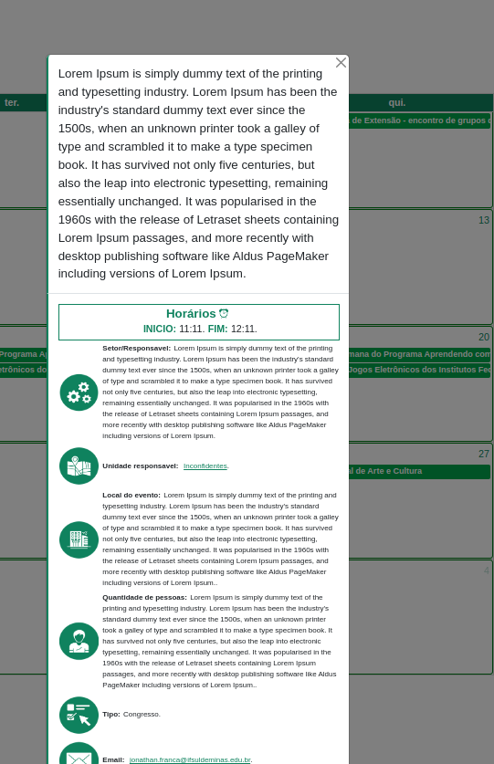

# CALENDÁRIO DE EVENTOS INSTITUCIONAIS 

<strong>Author:</strong> Jonathan Wesley Cijani Bertoni França.

<strong>Data:</strong> 10/06/2024

<strong>Email do Desenvolvedor:</strong>   jonathanwleycijani@gmail.com

---

# <center> MENU 📅</center>
## <center> 
|[Sobre o Projeto](#sobre-o-projeto) | 
|[Ferramentas utilizadas](#ferramentas-utilizadas) | 
|[Fluxo de Funcionamento](#fluxo-de-funcionamento-do-projeto)|
[Estrutura dos arquivos](#estrutura-dos-arquivos) | [Resultados dos testes](#Detalhes-técnicos) | [Considerações finais](#considerações-finais) | [Observações](#observacoes) | </center>

---


## Sobre o Projeto
Este projeto foi criado por Jonathan França a pedido de Roselei Eleotéreo para fornecer uma maneira visual de agendar eventos que ocorrem em todos os campi do IFSULDEMINAS.

## <CENTER>ACESSO RÁPIDO AS FERRAMENTAS</CENTER>
### <CENTER>|[Calendário Eventos Institucionais](https://eventosinstitucionais.ifsuldeminas.edu.br/)|[Planilha de gerenciamento de eventos](https://docs.google.com/spreadsheets/d/1_gz4pZVsK9-GWoZSlbVsDiYTCvu7l80OxDk3rkunMls/edit?pli=1#gid=394821800)|[Formulário para cadastro de usuário](https://docs.google.com/forms/d/e/1FAIpQLSejjMJ-FahxuKf-hmhl-NU8yJuvCtZR7RG7GNf9fV4JH6OIAw/viewform)|</CENTER>
## Ferramentas utilizadas

| FERRAMENTA         | UTILIZAÇÃO                                                    | DOCUMENTAÇÃO                                             | 
|--------------------|------------------------------------------------------------|----------------------------------------------------------|
| Fullcalendar       | Biblioteca JavaScript para calendário dinâmico            | [fullcalendar.io](https://fullcalendar.io/)             |
| Vanilla-Tilt       | Biblioteca JavaScript para aplicação de animações 3D      | [Vanilla-tilt.js](https://micku7zu.github.io/vanilla-tilt.js/) |
| Google Sheets / <br> Apps Script | Planilha do Google Sheets para armazenamento de eventos e geração de API usando Apps Script | [Apps Script](https://developers.google.com/apps-script/reference/document?hl=pt-br) |
| Google Forms       | Ferramenta web do Google para registro de eventos na planilha Google Sheets | [Google Forms](https://www.google.com/intl/pt-BR/forms/about/) |

## Fluxo de funcionamento do projeto


## Estrutura dos arquivos

| Icon | Descrição                               |
|-------|-----------------------------------------|
| 🖼️    | Arquivo de imagem                       |
| 🎨    | Arquivo de estilo CSS                   |
| 📅    | Arquivo HTML              |
| 📂    | Diretório ou Pasta                      |
| 💻    | Arquivo JavaScript                      |
| 📜    | Arquivo de Texto ou Documentação        |

---
```bash
.  📂
├── assets 📂
│   └── img
│       ├── clock.png | 🖼️
│       ├── email_icon.png | 🖼️
│       ├── favicon.ico | 🖼️
│       ├── iflogo.png | 🖼️
│       ├── loading.gif | 🖼️
│       ├── local_icon.png | 🖼️
│       ├── quantidade_icon.png | 🖼️
│       ├── responsavel_icon.png | 🖼️
│       ├── tipo_icon.png | 🖼️
│       └── unidade_icon.png | 🖼️
├── css | 📂
│   ├── responsive.css | 🎨
│   └── style.css | 🎨
├── fullcalendar-6.1.10 | 📂
│   ├── examples |  📂
│   │   ├── background-events.html | 📅
│   │   ├── daygrid-views.html | 📅
│   │   ├── external-dragging-2cals.html | 📅
│   │   ├── external-dragging-builtin.html | 📅
│   │   ├── full-height.html | 📅
│   │   ├── list-sticky-header.html | 📅
│   │   ├── list-views.html | 📅
│   │   ├── month-view.html | 📅
│   │   ├── multimonth-view.html | 📅
│   │   ├── multiweek-view.html | 📅
│   │   ├── natural-height.html | 📅
│   │   ├── selectable.html | 📅
│   │   └── timegrid-views.html | 📅
│   ├── LICENSE.md | 📜
│   ├── packages | 📂
│   └── README.md | 📜
├── index.html | 📅
├── js |  📂
│   ├── calendar.js | 💻
│   ├── core |  📂
│   │   ├── index.global.js | 💻
│   │   ├── index.global.min.js | 💻
│   │   ├── locales
│   │   │   ├── pt-br.global.js | 💻
│   │   │   ├── pt-br.global.min.js | 💻
│   │   ├── locales-all.global.js | 💻
│   │   └── locales-all.global.min.js | 💻
│   ├── index.global.js | 💻
│   ├── rellax.min.js | 💻
│   ├── scriptcalendar.txt | 📜
│   └── vanilla-tilt.js | 💻
├── jsongenerator.txt | 📜
└── README.md | 📜

```

## <center> Detalhes Técnicos </center>

## <center>|[Apps script](#apps-script) | |[Estrutura de Calendar.js](#calendarjs) | |[Fullcalendar](#fullcalendar) | |[Responsividade](#responsividade)|
 </center>

---

## Apps Script

CComo visto anteriormente no [Fluxo de funcionamento](#fluxo-de-funcionamento-do-projeto), todas as informações estão sendo armazenadas em uma planilha do Google Sheets. Para acessar seu código, siga o seguinte caminho: ```Extensões > Apps Script > código.gs```.


E então temos o seguinte código:


```bash

function doGet(req) {
  var nome = req.parameter.nome;
  var doc = SpreadsheetApp.getActiveSpreadsheet();
  var sheet = doc.getSheetByName('AGENDA_DE_EVENTOS');
  var values = sheet.getDataRange().getValues();

  var output = [];

  for (var i = 3; i < values.length; i++) {
    var row = {};
    start_time =  Utilities.formatDate(new Date(values[i][3]), Session.getScriptTimeZone(), "HH:mm");
    row['nome'] = values[i][1];
    row['data'] = Utilities.formatDate(new Date(values[i][2]), Session.getScriptTimeZone(), "yyyy-MM-dd'T'"+start_time+":00'Z'");
    row['horario_inicio'] = Utilities.formatDate(new Date(values[i][3]), Session.getScriptTimeZone(), "HH:mm");
    row['horario_fim'] = Utilities.formatDate(new Date(values[i][4]), Session.getScriptTimeZone(), "HH:mm");
    row['desc'] = values[i][5];
    row['unidade'] = values[i][6];
    row['setor'] = values[i][7];
    row['num'] = values[i][8];
    row['local'] = values[i][9];
    row['tipo'] = values[i][10];
    row['outros'] = values[i][11];
    row['email'] = values[i][12];
    output.push(row);
}


  if (nome != null) {
    var returnOutput = output.filter(obj => obj.nome.toLowerCase().includes(nome.toLowerCase()));
    return ContentService.createTextOutput(JSON.stringify({returnOutput})).setMimeType(ContentService.MimeType.JSON);
  }

  return ContentService.createTextOutput(JSON.stringify({output})).setMimeType(ContentService.MimeType.JSON);
}

```

Em resumo, este código está apenas percorrendo cada coluna da planilha e inserindo em uma lista de saída 'output'. Por fim, ele apenas fará suas formatações básicas, deixará no formato JSON e gerará sua URL de acesso a essas informações.

Para uma melhor visualização de cada coluna, aqui está o cabeçalho da planilha:


---

## FullCalendar

FullCalendar é uma biblioteca que facilita o desenvolvimento de um calendário funcional. Ele foi instalado localmente na máquina seguindo pelos arquivos locais de: `/fullcalendar-6.1.10`, que está basicamente sendo aplicado no arquivo `/index.html`, e boa parte de suas configurações básicas de funcionamento estão no script `/js/calendar.js`.

Para um melhor entendimento do conteúdo, recomenda-se visitar a documentação oficial do FullCalendar.

### Detalhes importantes em calendar.js

#### Integração com Apps Script:

Como vimos anteriormente em [Apps Script](#apps-script), nós geramos uma URL com o output de cada coluna da planilha. Então, a primeira coisa que o script faz é consultar essas informações para depois inseri-las no calendário.

```js
function eventSheet(callback) {
  fetch('https://script.google.com/macros/s/AKfycbxsPUtmqIaj5GZkhT2vN3NPkZvSa1M7RDbLpfXyAN4MKLuFFHBOEpge2xlR7nbvYouFGQ/exec')
    .then(response => response.json())
    .then(data => {
      const eventos = data.output.map(evento => ({
        title: evento.nome,
        start: evento.data,
        end: evento.data,
        description: evento.desc,
        local: evento.local,
        horario_inicio: evento.horario_inicio,
        horario_fim: evento.horario_fim,
        unidade: evento.unidade,
        setor: evento.setor,
        num: evento.num,
        tipo: evento.tipo,
        outros: evento.outros,
        email: evento.email
      }));

      callback(eventos);
    })
    .catch(error => {
      console.error('Erro ao obter os eventos', error);
      callback([]);
    });
}
```
Logo após isso, temos a nossa estrutura de carregamento das informações:


```js
document.addEventListener('DOMContentLoaded', function () {
  eventSheet(function (eventos) {
    var today = new Date();
    var prevClickedDay = null;


    var calendarEl = document.getElementById('calendar');
    var cabecalho = document.getElementById('cabecalho');
    var loader = document.getElementById('loader');
    var iflogo = document.getElementById('iflogo').style.display = "block";
    loader.style.display = "none";
    cabecalho.style.display = "flex";

    // INSTANCIA DO CALENDÁRIO
     var calendar = new FullCalendar.Calendar(calendarEl, {...});
    //  ==================================
     calendar.render();  

     adjustGridWidth();


    setInterval(adjustGridWidth, 500); 

    document.querySelectorAll('.fc-prev-button, .fc-next-button, .fc-today-button, .fc-dayGridMonth-button, .fc-timeGridWeek-button, .fc-timeGridDay-button, .fc-listWeek-button').forEach(function (button) {
    button.classList.remove('btn-primary');
    button.classList.add('btn', 'btn-success');
  });
});
;
  });
```

Explicação: Nesse **DOMContentLoaded**, temos basicamente 3 tipos de conteúdos:

- Animação de carregamento.
- O calendário em si.
- E a função `adjustGridWidth` que é utilizada na responsividade do programa.

Um detalhe a ser notado é que, no meu caso, eu tive algumas dificuldades de customizar o CSS do calendário por conta do Bootstrap embutido nele e sua sobreposição junto com o FullCalendar. Isso acabou afetando até mesmo sua responsividade, sendo necessário a injeção de script para fazê-lo responder conforme a tela. Então, por esse motivo, eu criei esse `querySelectorAll` e a função `adjustGridWidth()`, pois quando as informações são carregadas, o Bootstrap junto com essa biblioteca acaba sobrepondo todas as estilizações feitas. Portanto, essa função `adjustGridWidth()` faz a alteração nas linhas enquanto a animação de carregamento ocorre.


## FullCalendar

Agora vamos falar sobre as configurações do FullCalendar em si:


```js
 var calendar = new FullCalendar.Calendar(calendarEl, {
      
  });

  calendar.render();  

```

Com este trecho do código, podemos dividi-lo nas seguintes partes:

[Redirecionamento de data](#redirecionamento-do-usuário-para-a-data-desejada), 
[URL google maps](#switch-case-com-urls-do-google-maps), 
[Switch Case com URLs do google maps](#), 
[Modal de eventos](#manipulação-do-modal-de-evento),
[Formatação das strings](#formatação-das-strings),
[Responsividade](#responsividade)
</center>

## Configurações da biblioteca

Essas configurações definem o comportamento básico do calendário, como fuso horário, estilo visual, textos dos botões, cores dos eventos e a barra de ferramentas do cabeçalho.


```js
initialView: 'dayGridMonth',
initialDate: today,
navLinks: false,


```
## Switch Case com URLs do Google Maps:

Essa função lida com o evento de clique em um evento no calendário. Ela contém um switch case que mapeia diferentes locais para URLs do Google Maps com base nas informações do evento.


```js
  function getUrl(unidade) {
          let unidade_url = "";
          switch (unidade.toLowerCase().trim()) {

            case 'reitoria':
              unidade_url = 'https://www.google.com/maps/search/?api=1&query=Instituto+Federal+de+Educação+Ciência+e+Tecnologia+do+Sul+de+Minas+Gerais+REITORIA';
              break
            case 'carmo de minas':
              unidade_url = 'https://www.google.com/maps/search/?api=1&query=IFSULDEMINAS+-+Campus+Avançado+Carmo+de+Minas';
              break
            case '...':
             unidade_url = '...';
             break
            default:
              console.log('erro_locate')
          }

          return unidade_url;
        }
```


## Manipulação do modal de eventos

```js

eventClick: function (info) {
    // Formatação do título do evento
    const content_title = formatacao(info.event.title, 30);

    modalTitle.innerHTML = String(info.event.title);

    const setor_responsavel_frmtd = info.event.extendedProps.setor; 
    const local_frmtd = info.event.extendedProps.local;
    const unidade_frmtd = info.event.extendedProps.unidade;
    const num_frmtd = info.event.extendedProps.num;
    const tipo_frmtd = info.event.extendedProps.tipo;
    const outros_frmtd = info.event.extendedProps.outro;
    const email_frmtd = info.event.extendedProps.email;
    const desc_frmtd = info.event.extendedProps.description.toString();

    // Obtenção da URL do evento
    var uni_url = getUrl(unidade_frmtd);

    // Construção do conteúdo do modal
    modalBody.innerHTML = `
        <!-- Conteúdo do modal -->
    `;

    // Exibição do modal
    const modalevent = new bootstrap.Modal(document.getElementById('modalevent'));
    modalevent.show();
},


```
## Formatação das Strings

Repare bem que todas as variáveis contêm um método de formatação. Essa formatação ocorre basicamente como uma forma de a string não quebrar a linha e sair para fora do Modal. Aqui temos o código responsável por isso:


```js
     function formatacao(arg, limite) {
          if (typeof arg !== 'string') {
            return '';
          }
          let formattedString = '';
          for (let i = 0; i < arg.length; i += limite) {
            formattedString += arg.substring(i, i + limite) + '\n';
          }
          return formattedString;
        }


```

Em um caso de testes meio exagerado, este é o resultado dessa função:



## Responsividade

Agora vamos para a parte que foi um pouco trabalhosa em fazer com essa biblioteca, que é o fato de seu bootstrap sobrepor a todo tipo de tentativa de alteração. Então, aqui temos novamente nosso `querySelectorAll` selecionando as classes específicas da biblioteca e inserindo sua estilização:


```js
 viewDidMount: function (view) {

          var gridWidth = document.querySelector('.fc-daygrid-body.fc-daygrid-body-balanced');
          var tableWidth = document.querySelector('.fc-scrollgrid-sync-table');
          if (gridWidth) {
            gridWidth.style.width = '100%';

            tableWidth.style.width = "100%"
            tableWidth.style.height = "370px"
          }

        },
```

E claro, também temos um arquivo CSS onde aplicamos estilizações responsivas que não são totalmente sobrepostas pelo Bootstrap. Você pode acessá-lo em: `assets/css/responsive.css`.

